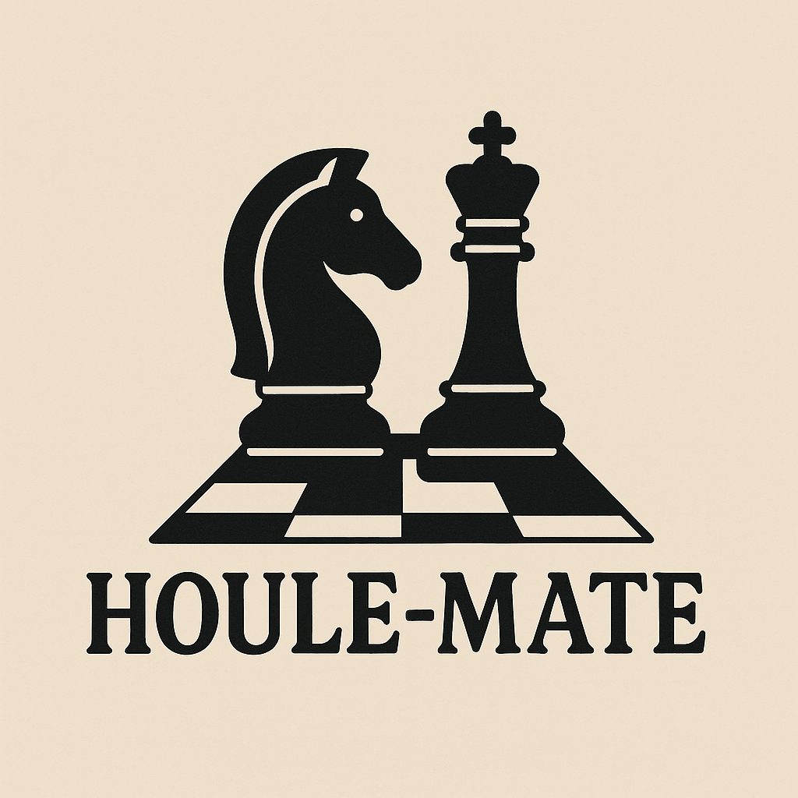

# Houle-Mate: C Chess Engine

A high-performance chess engine written in C, utilizing **bitboards** for efficient board representation and powered by the **Negamax algorithm** with **Alpha-Beta Pruning** for optimal move search.



## Features

* **Core Engine:** Implements the **Negamax search algorithm** coupled with **Alpha-Beta Pruning** for fast and deep search capabilities.
* **Board Representation:** Uses a highly efficient **Bitboard** (64-bit unsigned integers) representation for board state and move generation.
* **Move Generation:** Handles all standard and special chess moves, including Castling, En Passant, and Pawn Promotion.
* **Static Evaluation:** Utilizes a **Piece-Square Table (PST)** to calculate positional advantages during the search, providing a more intelligent evaluation than material balance alone.
* **Graphical Interface:** Built with **SDL2** (Simple DirectMedia Layer) to provide a functional and visual playing experience.

## Building and Running

This project uses `make` and requires the SDL2, SDL2_image, and SDL2_ttf libraries to build the graphical front-end.

1.  **Install Dependencies:** Ensure you have `gcc` and the required SDL2 development libraries installed on your system.

    ```bash
    # Example for Debian/Ubuntu based systems
    sudo apt-get install libsdl2-dev libsdl2-image-dev libsdl2-ttf-dev
    ```

2.  **Compile the Project:** Navigate to the root directory and run `make`.

    ```bash
    make
    ```

3.  **Run the Engine:**

    ```bash
    ./chess
    ```

## Future Development

The following features are planned to further optimize and enhance the engine:

* **Improved Search Speed:** Implementing multi-threading to parallelize the search algorithm.
* **Transposition Tables:** Integrating hash tables for recognizing and skipping previously analyzed positions to increase search efficiency (often the fifth, unnamed optimization technique).
* **Advanced Evaluation:** Adding logic for passed pawns and differentiating evaluation based on the stage of the game (opening, middlegame, endgame).

## Resources

* **Sebastian Lague - Chess Engine Series (Part 1)**
    * [https://www.youtube.com/watch?v=_vqlIPDR2TU&t=3529s](https://www.youtube.com/watch?v=_vqlIPDR2TU&t=3529s)
* **Sebastian Lague - Chess Engine Series (Part 2)**
    * [https://www.youtube.com/watch?v=U4ogK0MIzqk&t=172s](https://www.youtube.com/watch?v=U4ogK0MIzqk&t=172s)
* **Chess Programming Wiki**
    * [https://www.chessprogramming.org/Main_Page](https://www.chessprogramming.org/Main_Page)
* **Geeks for Geeks - Alpha-Beta Pruning** (Relevant to Negamax implementation)
    * [https://www.geeksforgeeks.org/minimax-algorithm-in-game-theory-set-4-alpha-beta-pruning/](https://www.geeksforgeeks.org/minimax-algorithm-in-game-theory-set-4-alpha-beta-pruning/)
